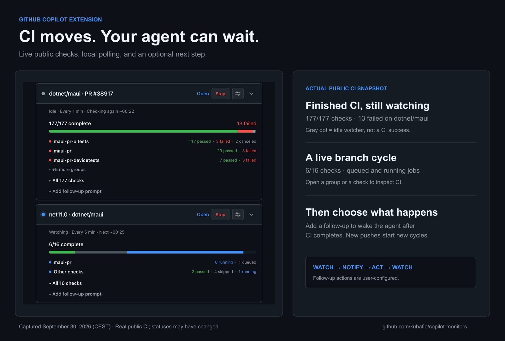
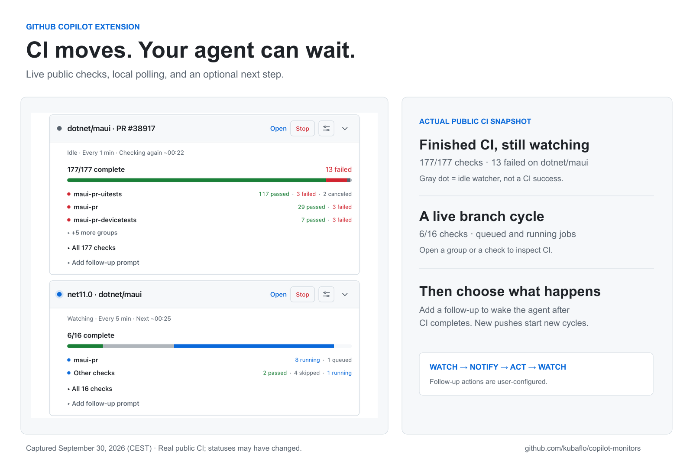
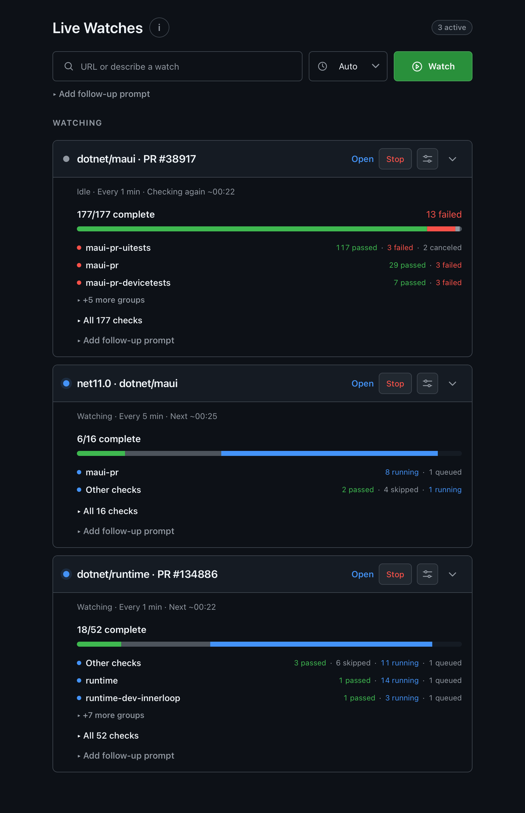
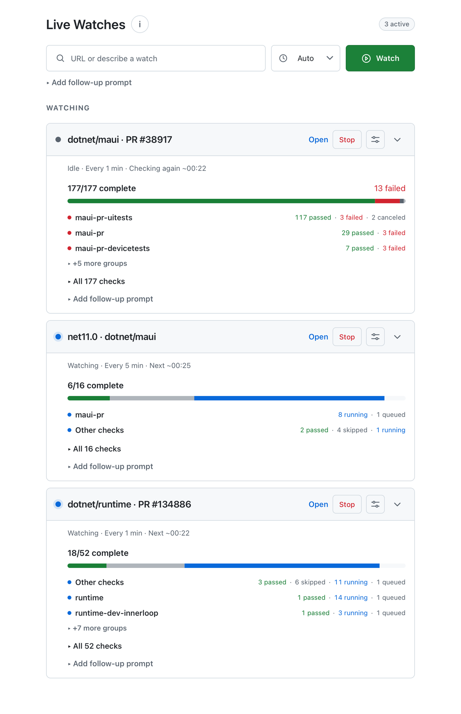
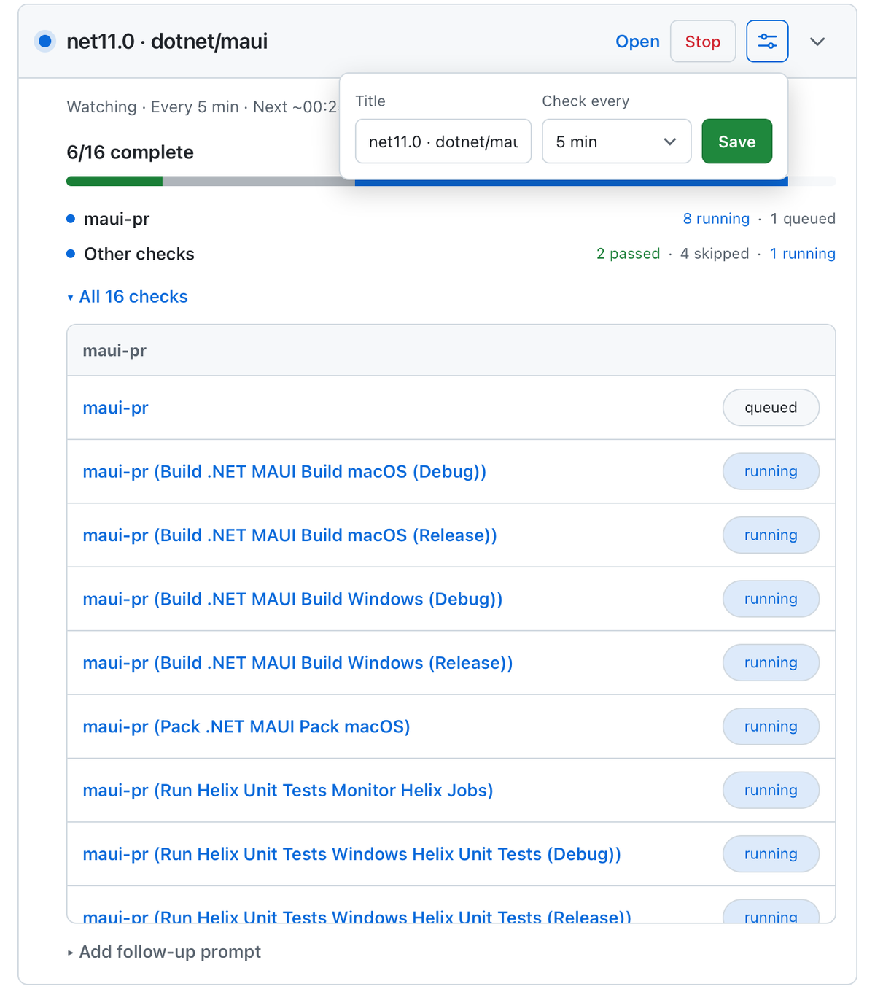

# Live Watches for GitHub Copilot

**Stop asking your agent whether CI is done.** Live Watches runs small,
deterministic watchers in the background and brings your agent back when
something actually changes. Follow PR checks, a branch, an Actions run, an
Azure build, or any condition your agent can express as a script.

**Zero model calls for idle polls.** Local scripts do the checking; your agent
can work on something else or stay idle until there is a result. See the
progress in a GitHub-themed canvas and optionally have the agent take the
next step when a watch fires.



## Why watch instead of asking?

| Repeated agent check-ins | Live Watches |
| --- | --- |
| The agent invokes tools and reasons through each "still running" result. | A local watcher polls without invoking the model. |
| You need to return to chat to check on progress. | The canvas updates with check-by-check CI progress. |
| A long wait can interrupt other work. | Several watches run concurrently while the agent does other work. |
| You have to prompt the agent again when CI finishes. | An optional follow-up can start automatically on completion or a branch change. |

For example, a 30-minute CI run checked once per minute can involve about
30 local polls and **no AI turns during the wait**. Repeatedly asking an agent
to poll would require new model/tool interactions. The token savings depend
on how often you would otherwise check; setup, event notifications, and
agent follow-ups can still use tokens. This is an alternative to AI-driven
polling, not a claim that every watch has a fixed cost saving.

<details>
<summary>See the light theme, full canvas, and check-level details</summary>









</details>

The graphics frame real captures of this session's Live Watches canvas, not
mock CI or a claim that all example repositories are being watched. They show
three public watches: completed checks on
[dotnet/maui#38917](https://github.com/dotnet/maui/pull/38917), in-progress
checks on the `dotnet/maui` `net11.0` branch, and
[dotnet/runtime#134886](https://github.com/dotnet/runtime/pull/134886).
Statuses were captured September 30, 2026 (CEST) and may have changed since. The
light-theme capture uses the canvas's light color mode.

## Get started

1. Install the
   [`copilot-monitors` extension folder](https://github.com/kubaflo/copilot-monitors/tree/main/copilot-monitors)
   at **user scope** using the GitHub Copilot app's extension installer.
   Reload extensions or restart Copilot. User scope makes it available across
   your local projects.
2. Open **Live Watches** and paste a supported link. The watch starts
   immediately, without an agent turn.
3. Keep working, or leave the agent idle. Inspect progress in the canvas;
   optionally set a follow-up for completed PR or branch CI cycles. On a
   continuous progress watch with already-complete checks (including custom
   Azure watchers), saving a follow-up queues it once for that prompt and
   current cycle, even if the prompt was configured at startup. Later completed
   cycles or a changed prompt can trigger it again. PR watches stay active across pushes until the PR closes or
   merges.

After a push, the next configured poll clears the previous commit's results
and displays the new CI cycle (or pending inventory until its jobs appear).
The canvas refreshes automatically; no manual watch restart is needed.
Completed and stopped watches disappear from the canvas; watcher failures
remain visible for diagnosis.
Branch links use GitHub's **current status-check rollup** on the head commit:
job-level CI and other current checks, without older rerun records. The title
opens its configured destination, and group/check names link to the available
CI results.

The blue dot means the watcher is active with work pending; a muted gray dot
means its known checks are finished and it is idle until its next poll, **even
if CI failed**. Red signals a watcher error, not a failed CI job. The card
distinguishes checking now, retrying, watching, and idle, and shows the next
check time when applicable. The check bar and grouped counts distinguish
passed, failed, canceled, skipped, running, and queued work.

Alternatively, on macOS or Linux, install from a fresh clone:

```bash
git clone https://github.com/kubaflo/copilot-monitors.git
mkdir -p "${COPILOT_HOME:-$HOME/.copilot}/extensions"
cp -R copilot-monitors/copilot-monitors "${COPILOT_HOME:-$HOME/.copilot}/extensions/"
```

This copies the folder to
`${COPILOT_HOME:-$HOME/.copilot}/extensions/copilot-monitors/` so
`extension.mjs` is directly inside it.

Install and authenticate the [GitHub CLI](https://cli.github.com/) to watch
GitHub checks. Azure DevOps public builds can be read anonymously; private
builds may require `az login`. Branch watches need a GitHub CLI login authorized for the organization's
current checks. If SSO blocks commit metadata, its anonymous public API
fallback has a lower rate limit.

## What can I watch?

Paste a link in the canvas for a ready-made watcher:

| Target | Example |
| --- | --- |
| Pull request checks | `https://github.com/dotnet/runtime/pull/134886` |
| Actions run | `https://github.com/dotnet/runtime/actions/runs/36638671692` |
| Branch commits and head CI | `https://github.com/dotnet/maui/tree/net11.0` |
| Azure DevOps build | `https://dev.azure.com/dnceng-public/public/_build/results?buildId=1616959` |

`#123` watches PR checks in the current repository. Direct branch links support
one path segment. For anything else, ask the agent for a custom watch, such
as **"Watch build.log and tell me when the smoke tests fail."** The agent
writes a shell command that prints only meaningful changes, so quiet polls
do not wake it. PR and branch watches can continue reporting events; an
individual Actions run or Azure build ends after completion.

For the `dotnet/maui` `main`, `net11.0`, `release/11.0.1xx-rc2`,
`inflight/current`, and `inflight/candidate` branches, the bundled
[`MAUI branch example`](copilot-monitors/examples/watch-maui-branch-ci.mjs)
shows exact-head Azure pipeline **jobs** rather than GitHub check-run
summaries. Ask the agent to start it as a continuous watch; the
[extension guide](copilot-monitors/README.md#maui-branch-azure-jobs-example)
includes a one-shot verification command and CI-only follow-up settings.
To act when just `maui-pr` finishes, rather than waiting for UI and device
tests, ask for `--notify-pipeline maui-pr` and a matching follow-up prefix.

The settings control edits the display title and a **running built-in**
watch's polling frequency (30 seconds to 15 minutes) without restarting it.
The initial frequency selector applies only to new watches. Cards start
expanded and can be collapsed independently; the canvas follows the Copilot
app theme. A completed one-shot watch or manually stopped watch disappears
from the canvas automatically; a watcher failure remains visible for
diagnosis. The agent can still inspect monitor output after a card disappears.

For a fix → push → observe loop, set a bounded PR follow-up such as “If CI
failed, fix it, validate, commit and push; stop when CI passes or after three
attempts.” Each subsequent completed CI cycle can wake the agent again. A
watch does **not** fix code, push, or start CI by itself: those steps depend on
the user-configured prompt and the repository's normal CI trigger. Chat shows
a compact monitor status and, when a follow-up runs, its custom prompt and the
agent's answer rather than raw watch output.

**Built-in links versus custom scripts:** The link presets provide the
GitHub check rollup or Azure build timeline, default polling cadence, and
clickable CI destinations. Built-in PR and branch watches also reset their
checks on head changes and use the completion semantics described here. Agent-
written shell watches report only what their scripts emit; their cadence
cannot be edited in the canvas, and they do not automatically gain a check
rollup or head-change handling. Custom continuous watches can limit follow-ups
to matching stdout prefixes while reporting other events normally.
Up to 30 watches can run in one session. See
[`copilot-monitors/README.md`](copilot-monitors/README.md) for the complete
behavior and limits.

**Local execution and safety:** Polling runs on your machine with your
permissions, not in a hosted service. Pasting a recognized link starts its
built-in watcher immediately. Review agent-written commands before allowing
them to run; treat watch output as data, not instructions. Watches stop when
the session or extension stops and do not survive restarts.

## Development

No npm installation or build step is needed. The Copilot runtime provides its
extension SDK. Run the focused Node tests from the extension folder:

```bash
cd copilot-monitors
node --test *.test.mjs examples/*.test.mjs
```

Licensed under [MIT](LICENSE).
