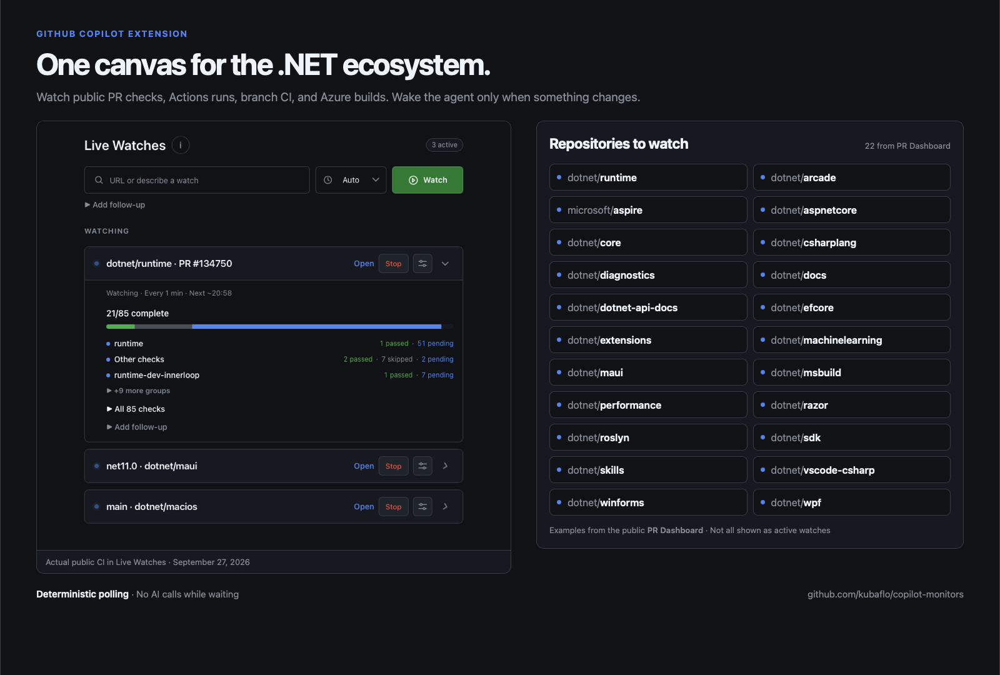
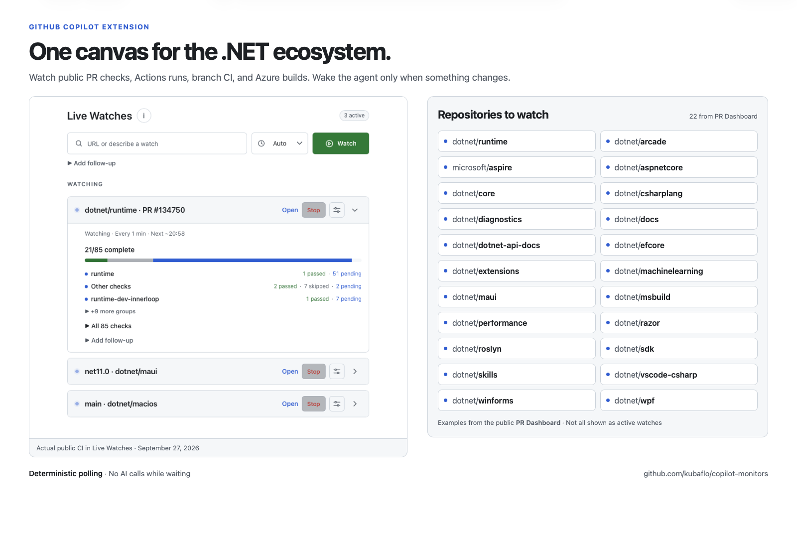
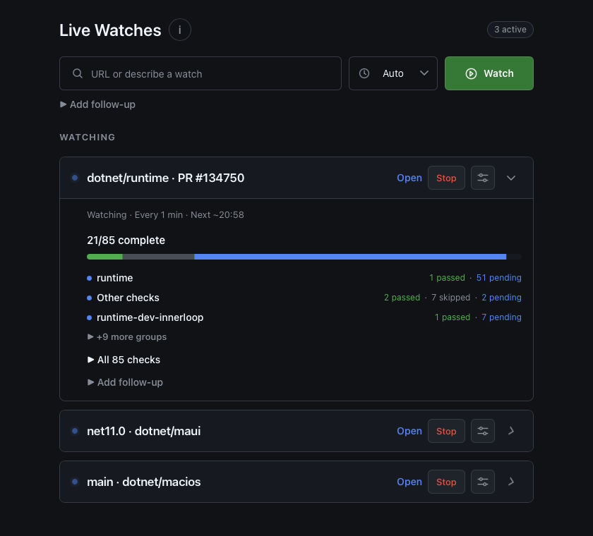
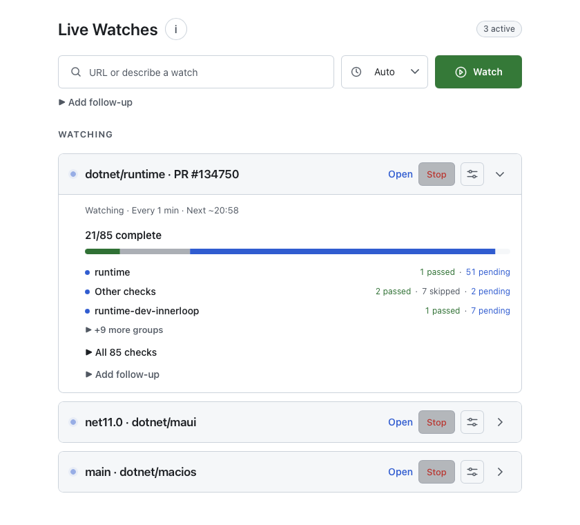
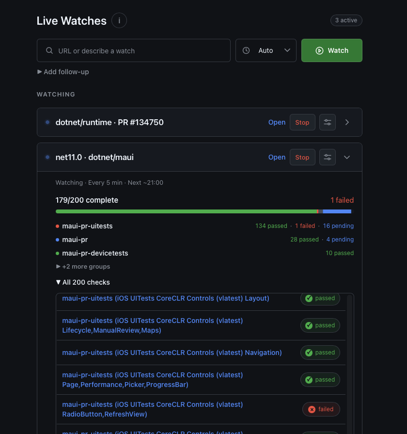

# Live Watches for GitHub Copilot

**Stop asking your agent whether CI is done.** Live Watches runs small,
deterministic watchers in the background and brings your agent back when
something actually changes. Follow PR checks, a branch, an Actions run, an
Azure build, or any condition your agent can express as a script.

**Zero model calls for idle polls.** Local scripts do the checking; your agent
can work on something else or stay idle until there is a result. See the
progress in a GitHub-themed canvas and optionally have the agent take the
next step when a watch fires.



## Why watch instead of asking?

| Repeated agent check-ins | Live Watches |
| --- | --- |
| The agent invokes tools and reasons through each "still running" result. | A local watcher polls without invoking the model. |
| You need to return to chat to check on progress. | The canvas updates with check-by-check CI progress. |
| A long wait can interrupt other work. | Several watches run concurrently while the agent does other work. |
| You have to prompt the agent again when CI finishes. | An optional follow-up can start automatically on completion or a branch change. |

For example, a 30-minute CI run checked once per minute can involve about
30 local polls and **no AI turns during the wait**. Repeatedly asking an agent
to poll would require new model/tool interactions. The token savings depend
on how often you would otherwise check; setup, event notifications, and
agent follow-ups can still use tokens. This is an alternative to AI-driven
polling, not a claim that every watch has a fixed cost saving.

<details>
<summary>See the light theme, actual canvas, and check details</summary>









</details>

The gallery pairs an actual Live Watches capture with **all 22 repositories**
listed by the [PR Dashboard](https://danmoseley.github.io/pr-dashboard/index.html),
including `microsoft/aspire`. The graphics illustrate targets, not 22
simultaneously running watches. Public CI statuses were captured on
September 27, 2026 and may have changed since.

## Get started

1. Install the
   [`copilot-monitors` extension folder](https://github.com/kubaflo/copilot-monitors/tree/main/copilot-monitors)
   at **user scope** using the GitHub Copilot app's extension installer.
   Reload extensions or restart Copilot. User scope makes it available across
   your local projects.
2. Open **Live Watches** and paste a supported link. The watch starts
   immediately, without an agent turn.
3. Keep working, or leave the agent idle. Inspect progress in the canvas;
   optionally set a follow-up for when the result arrives.

Alternatively, on macOS or Linux, install from a fresh clone:

```bash
git clone https://github.com/kubaflo/copilot-monitors.git
mkdir -p "${COPILOT_HOME:-$HOME/.copilot}/extensions"
cp -R copilot-monitors/copilot-monitors "${COPILOT_HOME:-$HOME/.copilot}/extensions/"
```

This copies the folder to
`${COPILOT_HOME:-$HOME/.copilot}/extensions/copilot-monitors/` so
`extension.mjs` is directly inside it.

Install and authenticate the [GitHub CLI](https://cli.github.com/) to watch
GitHub checks. Azure DevOps public builds can be read anonymously; private
builds may require `az login`. If GitHub CLI authentication is blocked by
organization SSO, public branch watches can use GitHub's anonymous API;
choose a longer interval for repositories with many checks to respect its
lower rate limit.

## What can I watch?

Paste a link in the canvas for a ready-made watcher:

| Target | Example |
| --- | --- |
| Pull request checks | `https://github.com/dotnet/runtime/pull/134750` |
| Actions run | `https://github.com/dotnet/maui/actions/runs/123` |
| Branch commits and head CI | `https://github.com/dotnet/maui/tree/net11.0` |
| Azure DevOps build | `https://dev.azure.com/dnceng-public/public/_build/results?buildId=123` |

`#123` watches PR checks in the current repository. Direct branch links support
one path segment. For anything else, ask the agent for a custom watch, such
as **"Watch build.log and tell me when the smoke tests fail."** The agent
writes a shell command that prints only meaningful changes, so quiet polls
do not wake it. A watch can continue reporting events or end after a
one-shot condition.

The canvas groups checks by pipeline, shows pending, passed, failed, skipped,
and canceled results, and lets you rename watches, change the built-in
polling frequency, or configure a follow-up. Cards start expanded and can be
collapsed independently; the canvas follows the Copilot app theme. Up to
30 watches can run in one session. See
[`copilot-monitors/README.md`](copilot-monitors/README.md) for the complete
behavior and limits.

**Local execution and safety:** Polling runs on your machine with your
permissions, not in a hosted service. Pasting a recognized link starts its
built-in watcher immediately. Review agent-written commands before allowing
them to run; treat watch output as data, not instructions. Watches stop when
the session or extension stops and do not survive restarts.

## Development

No npm installation or build step is needed. The Copilot runtime provides its
extension SDK. Run the focused Node tests from the extension folder:

```bash
cd copilot-monitors
node --test *.test.mjs
```

Licensed under [MIT](LICENSE).
